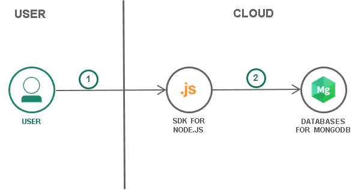

# MeanStack

MEAN is a free and open-source JavaScript software stack for building dynamic web sites and web applications. Because all components of the MEAN stack support programs that are written in JavaScript, MEAN applications can be written in one language for both server-side and client-side execution environments
___
## What is MEAN?

A relatively new stack, MEAN stands for MongoDB, Express.js, AngularJS, and Node.js. MEAN is an end-to-end JavaScript stack largely used for cloud-ready applications. Understanding why you might use it, identifying examples of when to employ it, and diving deeper into the individual components can help you maximize the value of MEAN for software development.

> Here are a few examples for using MEAN:

- Calendars
- Expense tracking
- News aggregation sites
- Mapping and location finding
___
# Benefits
MEAN is an open source web stack that is mainly used to create cloud-hosted applications. MEAN stack applications are flexible, scalable, and extensible, making them the perfect candidate for cloud hosting. The stack includes its own web server so it can be deployed easily, and the database can be scaled on demand to accommodate temporary usage spikes. A MEAN application enters the world optimized to take advantage of all the cost savings and performance improvements of the cloud.

JavaScript has long been a popular language for front-end web development—it’s flexible, dynamic, and easy to use. But it has been an option only for backend and database development for a few years, allowing developers to create applications using end-to-end JavaScript. Because every part of MEAN uses the same language, you can streamline your development teams. MEAN removes the need to hire different specialists to develop each part of an application. Instead, you can use a single pool of JavaScript developers to work adaptively, where and when needed. Standardizing on JavaScript also provides an opportunity to reuse code across the entire application, reducing unnecessary reinvention. 

# Components
___
## MongoDB
MongoDB is an open source, NoSQL database designed for cloud applications. It uses object-oriented organization instead of a relational model.

In the MEAN stack, MongoDB stores the application’s data. Because both the application and the database use JavaScript, there’s no need to translate the object as it journeys from the application to the database and back. The application can push and pull objects between the back end and the database without missing a beat.

MongoDB is touted for its scalability in both storage and performance. You can add fields to the database without reloading the entire table, and MongoDB is well known for its ability to manage large amounts of data without compromising on data access. With just a few clicks, you can expand the resources available to your database, making it perfect for applications with occasional periods of increased activity.
___
## Express
Express is a web application framework for Node.js. It balances ease of use and a full feature set.

Forming the backend of the MEAN stack, Express handles all the interactions between the frontend and the database, ensuring a smooth transfer of data to the end user. It’s designed to be used with Node.js and so continues the consistent use of JavaScript throughout the stack.

Express is minimalist—it’s designed to efficiently handle processes without cluttering your application. But don’t confuse minimalist with featureless. Express offers excellent error handling and templating functionality to aid your development.

Express can also protect you from yourself because it uses the CommonJS module standard to prevent inadvertent overwriting of variables within the shared namespace. You can’t accidentally redefine a variable that you previously created. This enforcement of JavaScript closures can help prevent a time-consuming and costly error.
___
## AngularJS

AngularJS—Google’s JavaScript frontend framework—isn’t the only frontend framework in use, but it’s exceedingly popular. It is effectively the default for frontend JavaScript development. If you’re developing a web application in JavaScript, you’re using AngularJS.

The MEAN stack includes AngularJS to help developers build the user-facing side of the application. Because the backend, frontend and database are all built on JavaScript, there’s a smooth flow of information between all parts of your application.

AngularJS didn’t become the most popular JavaScript frontend framework by mistake. Its ability to simultaneously develop for desktop and mobile use, its well-tuned performance and its easy-to-use templates make it the ideal front end to build cloud-native applications.
___
## Node.js
Node.js is an open source JavaScript framework that uses asynchronous events to process multiple connections simultaneously. It is an ideal framework for a cloud-based application, as it can effortlessly scale requests on demand. You’re likely to find Node.js behind most well-known web presences.

Node.js is the backbone of the MEAN stack. Express is purpose-built to work on top of Node.js, and AngularJS connects seamlessly to Node.js for fast data serving. Node.js comes complete with an integrated web server, making it easy to deploy your MongoDB database and application to the cloud.
The greatest strength of Node.js is its scalability. Cloud applications are best when they can respond quickly to usage spikes. What good is virtually unlimited processing power if it’s only available after your users time out? By expanding your resources as they’re needed, you’re able to serve more users while the framework’s single-thread architecture allows the application to effectively provide a smooth user experience across numerous connections. Node.js can support as many as a million simultaneous connections.

Remember, Node.js works best with many low-resource requests as opposed to resource-intensive requests. While a single thread protects against process deadlocks, it’s not immune to a large process freezing the system for all clients.
